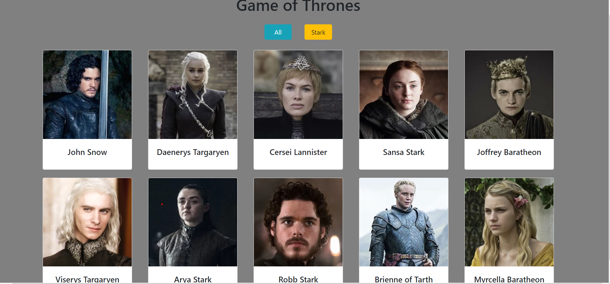
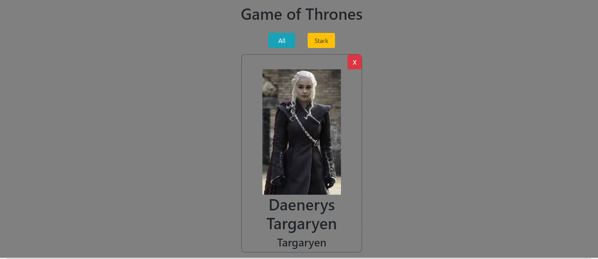

# Thrones
This project is exploration of ES6 modules, JSON and XHR request. Games of Throne displays 10 characters card. Clicking on each card will display details card. In addition, you can sort characters by house name.


## Screenshots
1. Initial Page


2. Detail Card



## How to run this project
* Use npm to install http-server in your terminal:
```
npm install -g http-server
```
* Run the server
```
hs -p 9091
```
* Open chrome and navigate to :
```
localhost:9091
```
